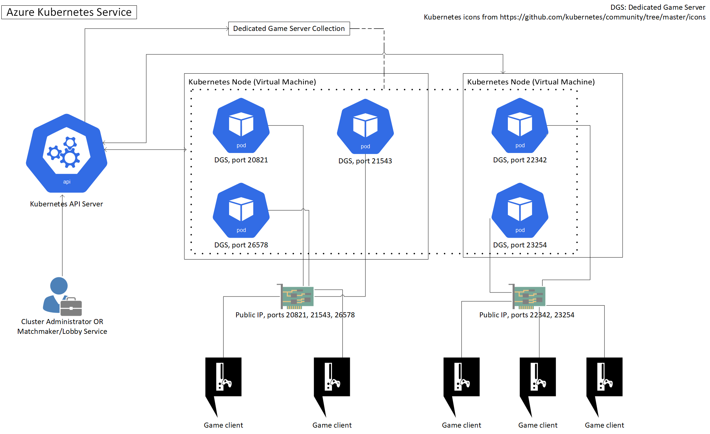

# Scaling multiplayer Dedicated Game Servers on Azure Kubernetes Service

Scaling Dedicated Game Servers (DGS) is a hard problem. They're stateful (having the bulk of player data stored in server memory), can't be explicitly shut down (since players might be still enjoying their game) and, as a rule of thumb, their connection with the players must be of minimal latency, especially for real-time multiplayer games.

This repository aims to provide a solution/guidance/building blocks for managing containerized dedicated game servers using the [Kubernetes](https://k8s.io) orchestrator on Azure using the managed [Azure Kubernetes Service (AKS)](https://azure.microsoft.com/en-us/services/kubernetes-service/). However, you could probably use parts of the project to scale memory-stateful workloads.

~ This is currently a work in progress. Not recommended for production use ~

## Documentation

- [Installation](docs/installation.md)
- [Architecture](docs/architecture.md)
- [Controllers](docs/controllers.md)
- [Development and e2e testing](docs/development.md)
- [Autoscaling](docs/scaling.md)
- [FAQ](docs/FAQ.md)
- [Other Kubernetes resources](docs/resources.md)

## Other

### Demos

In order to demonstrate this project, we've built a simple "echo" UDP server in Node.js and we've also adapted the [OpenArena](http://openarena.wikia.com/wiki/Main_Page) open source game so it can work with our solution. Both Dockerfiles are stored in the `demos` folder whereas the corresponding Kubernetes deployment YAML files are located in the `artifacts/examples` folder.

### Docker Hub Images

Images used for this project are hosted on Docker Hub:

- [OpenArena game sample](https://hub.docker.com/r/dgkanatsios/docker_openarena_k8s/)
- [A Node.js UDP echo server](https://hub.docker.com/r/dgkanatsios/simplenodejsudp/)
- [API Server](https://hub.docker.com/r/dgkanatsios/aks_gaming_apiserver/)
- [Controllers](https://hub.docker.com/r/dgkanatsios/aks_gaming_controller/)

### Architecture Diagram

### Thanks

To [Brian Peek](https://github.com/BrianPeek) and [Andreas Pohl](https://twitter.com/annonator) for the countless discussions we had (and still have!) about scaling DGSs. Moreover, I'd like to express my gratitude to the awesome people on *#sig-api-machinery* channel on [Kubernetes Slack](http://slack.k8s.io/) for answering a lot of my questions during the development of this project. 

### Presentation

Checkout a presentation I gave about this project on Open-conf conference in Greece, on March 2019.

---
This is not an official Microsoft product.
